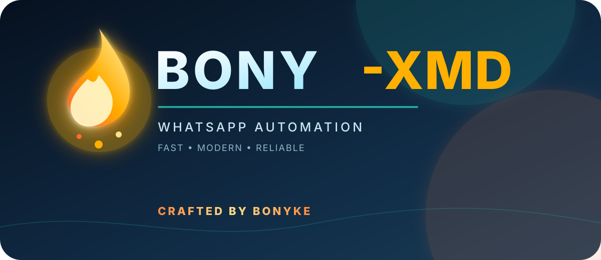

  
   
  <h1>BONY-XMD</h1>
  
<strong>BONY XMD</strong> <em>repository</em>

  

    
    
  

## About BONY-XMD

BONY-XMD is a modular WhatsApp automation project with command plugins, group utilities, media tools, search features, and configurable bot behavior. The project is organized so new commands can be added without disturbing the existing command registry.

> **Project identity:** BONY-XMD is the bot name. The source repository is **BONY-XMD**.

  
  

  

  <strong>1. FORK REPOSITORY</strong>
   
  

  <strong>2. GET SESSION ID</strong>
   
  

  <strong>3. DEPLOY TO HEROKU</strong>
   
  

  <strong>4. DOWNLOAD BOT ZIP</strong>
   
  

